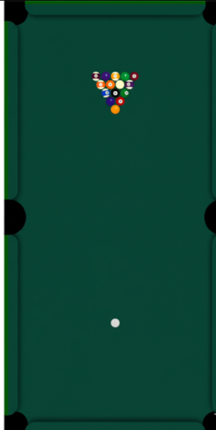

# 🎱 8 Ball Pool Game

A real-time 8 Ball Pool game built using **C**, **Python**, **SQL**, **JavaScript**, **HTML**, and **CSS** — combining the power of low-level performance with web-based interactivity. This project features accurate ball physics, real-time gameplay, and smooth client-server communication.



---

## 🚀 Features

- 🕹️ **Real-Time Gameplay** — Players interact live, thanks to Python-JavaScript communication.
- 🎯 **Accurate Ball Physics** — Physics handled via C, ensuring precise collision detection and motion.
- 💾 **State Management** — Ball positions and game state stored and queried using SQL.
- 🌐 **Web Interface** — Interactive game UI using JavaScript, HTML, and CSS.
- 🛠️ **Modular Design** — Easily extendable architecture for adding features like AI opponents or multiplayer matchmaking.

---

## 🧰 Tech Stack

| Language      | Purpose                                 |
|---------------|-----------------------------------------|
| C             | Ball physics engine                     |
| Python        | Backend logic, game state management    |
| SQL           | Database for storing game state         |
| JavaScript    | Frontend interactivity & real-time updates |
| HTML/CSS      | Game interface and layout               |

---

## 📦 Setup Instructions

1. **Clone the repository:**
   ```bash
   git clone https://github.com/yourusername/8-ball-pool.git
   cd 8-ball-pool
